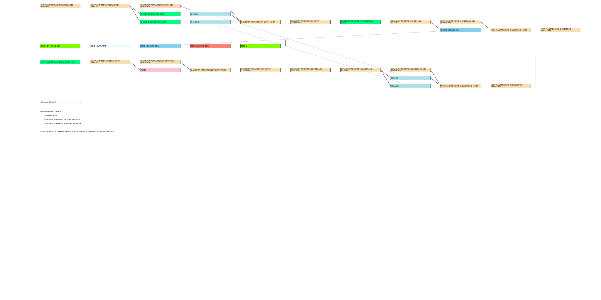

# Building Energy Modeling

## Default PLR curves

For AHUs with constant setpoint:

$$ FFLP = 0.00153 + 0.005208 PLR + 1.108624 PLR² + -0.11636 PLR³ $$


## EnergyPlus

- Plant only model, use `LoadProfile:Plant` to simulate the measured
  loads.

- Only two objects are required for every simulation: `Building` and
  `GlobalGeometryRules`.

- For Plant Loops/Air side Loops, only one splitter and one mixer are
  allowed per side. This is tremendously frustrating, but is the current
  limitation. Therefore, almost always going to have the following
  boilerplate

```idf
ConnectorList,
  CHW Supply Connector List, ! Name RefList: [ConnectorLists], REQ, #1
  Connector:Splitter,        ! Connector 1 Object Type [Connector:Splitter, Connector:Mixer], REQ, #2
  CHW Supply Splitter,       ! Connector 1 Name [PlantConnectors], REQ, #3
  Connector:Mixer,           ! Connector 2 Object Type [Connector:Splitter, Connector:Mixer], #4
  CHW Supply Mixer;          ! Connector 2 Name [PlantConnectors], #5

! Min Fields: 3
Connector:Splitter,
  CHW Supply Splitter, ! Name RefList: [PlantConnectors], REQ, #1
  ,                    ! Inlet Branch Name [Branches], REQ, #2
  ;                    ! Outlet Branch 1 Name [Branches], REQ, #3

! Min Fields: 3
Connector:Mixer,
  CHW Supply Mixer, ! Name RefList: [PlantConnectors], REQ, #1
  ,                 ! Outlet Branch Name [Branches], REQ, #2
  ;                 ! Inlet Branch 1 Name [Branches], REQ, #3

```

- Another limitation of plant loops is that you cannot have a pump in
  both the parallel portion of the side and the series portion of the
  side. The consequence of this is that for a constant primary/variable
  secondary system, the secondary pumps have to actually be placed on
  the "Demand" side of the loop.



- To run `HVAC-Diagram.exe` to make the node SVG, you need to be in the
  working directory with the `.bnd` file, and the file needs to be named
  `eplusout.bnd`. It is called with no arguments.


## timestep (program)

[link](https://michaelsweeney.github.io/timestep/)

## BEST (Best Energy Software Tools) Directory

https://www.buildingenergysoftwaretools.com/. Useful repository of software related to building energy modeling.
