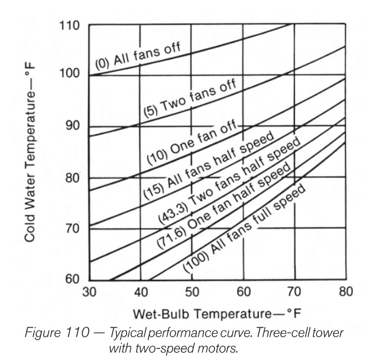
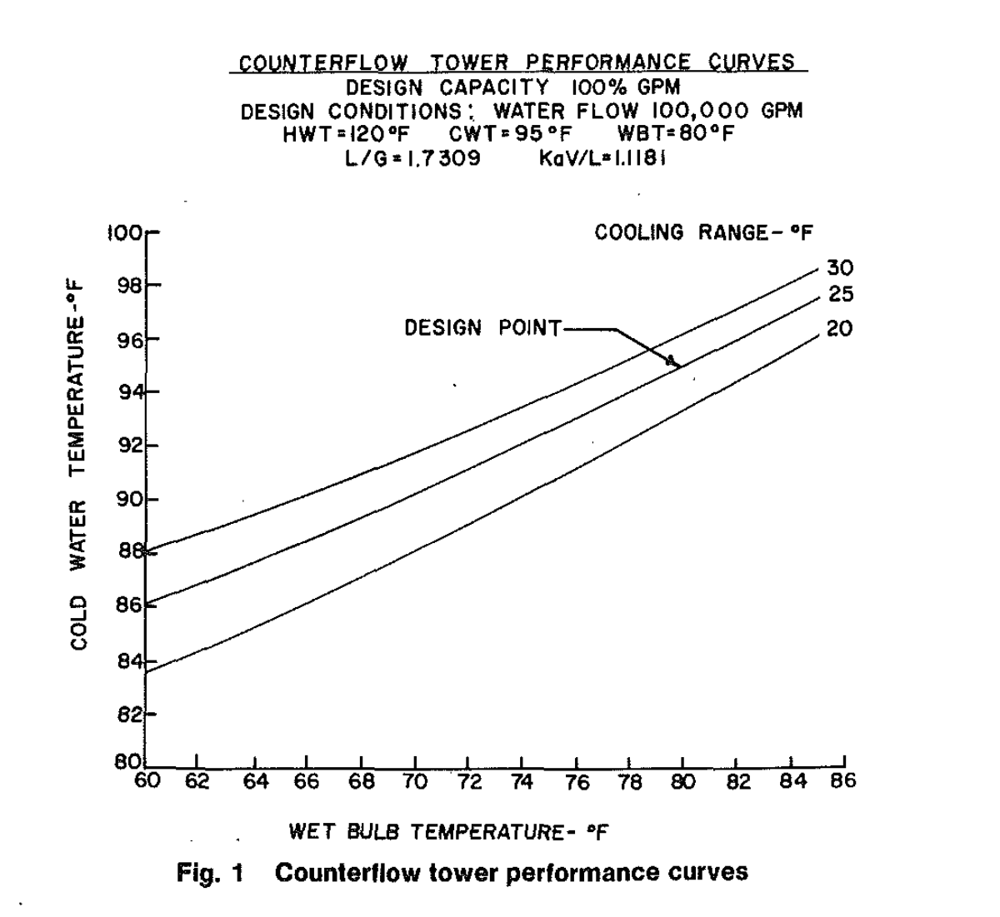

# Cooling Towers

## Variable Flow over Cooling Towers

From presentation on 2021-03-10: `2021-03-10_ashrae_variable_flow_over_cooling_towers.pdf`

- Safer and easier to implement for cross flow cooling towers
  - Can generally turn down to 30% of design for cross flow
  - Only can turn down to 70% or so for counter flow.

- Can use nozzle cups for cross flow towers.

## Rules of thumb for CFM

From [forum](http://www.refrigeration-engineer.com/forums/showthread.php?46112-Cooling-Tower-CFM-Per-Ton),
state 250 CFM/ton.
This may have been based on this [source?](https://www.cedengineering.com/userfiles/Heat%20Rejection%20Options%20R1.pdf)

See Bhatia Heat Rejection Options.

EnergyPlus uses the following assumption for air flow rate, I/O `CoolingTower:TwoSpeed`. 190 is pressure rise, in Pa.
V is in m3/s. P is power in watts.

$$
V = \frac{0.5 Power}{190}
$$

## Typical Performance Curves

Straight-ish line plotting CWST (Y) vs. Wet-bulb temperature (X).

## YorkCalc

Based on paper:

"CALIBRATION OF AN ENERGYPLUS CENTRAL COOLING PLANT MODEL WITH MEASUREMENTS AND INTER-PROGRAM COMPARISON"

The coefficients are:
Y = Approach = CWST - Twb

Twb
Tr = CWRT - CWST
LG = (mw / mwd) / (ma / mad)

where d is for design.

27 coefficients. All combinations up to cubic for all parameters.
